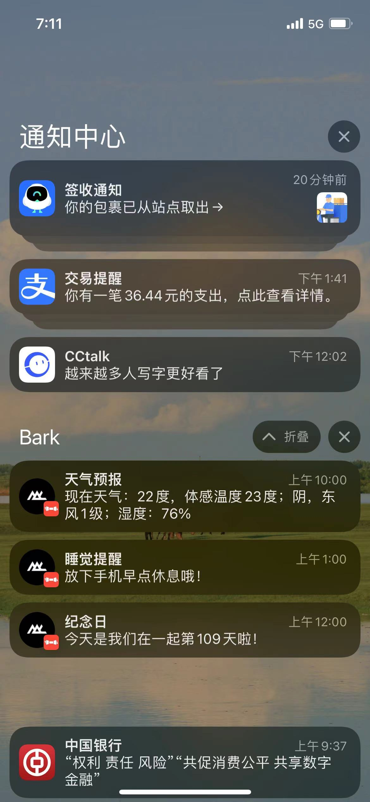

# Love Fortune

Love Fortune 是一个定时执行 [Bark](https://github.com/Finb/Bark) 任务的应用。他提供了一系列 REST API 接口可供用户添加、删除 Bark 任务。同时 Love Fortune 支持模板消息，由 `plugin` 模块提供类似于纪念日、每日天气之类的模板数据。

## Run

运行前需要设置一个`ACCESS_KEY`用于保护 API 访问端点。

```sh
export ACCESS_KEY=40be1d22-9924-4409-b86e-2d095b22fece
export PORT=8080
./lovefortune
```

运行后会在当前目录下生成数据库文件：`lovefortune.db`所有的定时任务都会保存在此数据库中。

## API Example

添加任务

> `spec`字段的格式参考[CRON Expression Format](https://pkg.go.dev/github.com/robfig/cron?utm_source=godoc#hdr-CRON_Expression_Format)。

```sh
curl --location --request POST 'http://localhost:8080/api/tasks' \
--header 'X-Access-Token: 40be1d22-9924-4409-b86e-2d095b22fece' \
--header 'Content-Type: application/json' \
--data-raw '{
        "spec": "0 0 10 * * *",
        "description": "天气预报",
        "content": "{{ $w := (weather \"101220601\").Now }}现在天气：{{$w.Temp}}度，体感温度{{$w.FeelsLike}}度；{{$w.Text}}，{{$w.WindDir}}{{$w.WindScale}}级；湿度：{{$w.Humidity}}%",
        "title": "天气预报",
        "deviceKey": "<BARK_DEVICE_KEY>",
        "icon": "https://www.gravatar.com/avatar/4976aa65dfbcc0755de7b76a7b540ad6?s=80"
    }'
```

列出所有任务

```sh
curl --request GET \
  --url http://localhost:8080/api/tasks \
  --header 'X-Access-Token: 40be1d22-9924-4409-b86e-2d095b22fece'
```

删除任务

```sh
curl --request DELETE \
  --url http://localhost:8080/api/tasks/3467d497-4629-4926-a233-4aaf804c3af9 \
  --header 'X-Access-Token: 40be1d22-9924-4409-b86e-2d095b22fece'
```

查看某任务的所有运行日志

```sh
curl --request GET \
  --url http://localhost:8080/api/logs/1e0adbf1-4b52-4140-a6cc-9c50d3e5e669 \
  --header 'X-Access-Token: 40be1d22-9924-4409-b86e-2d095b22fece' \
  --header 'content-type: application/json'
```

## 截图


